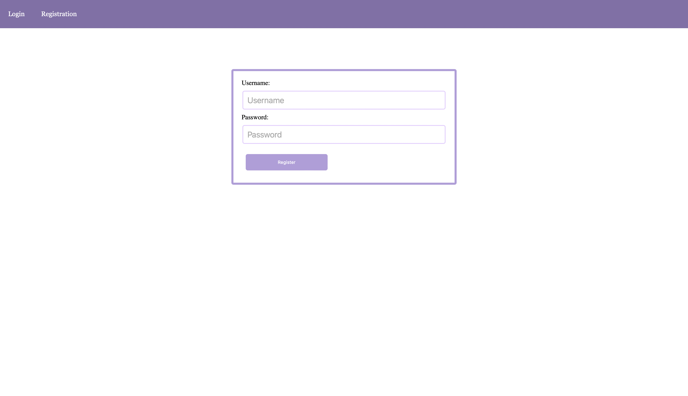
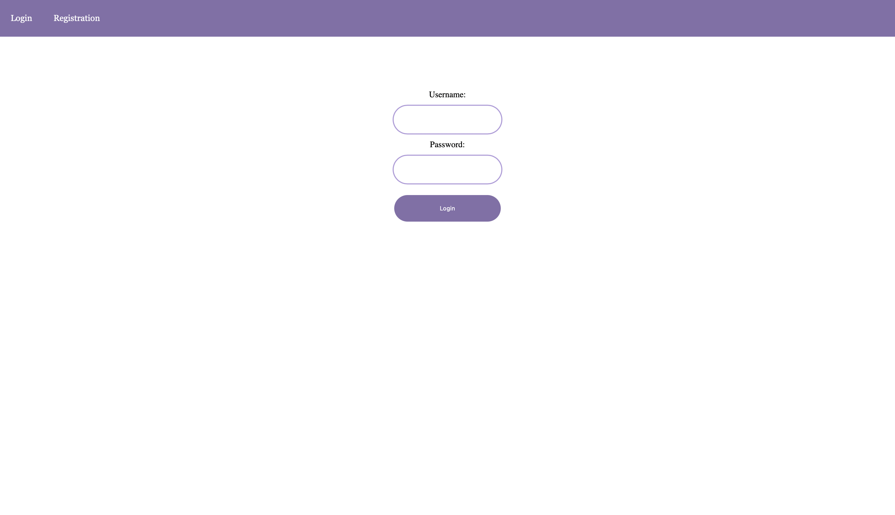
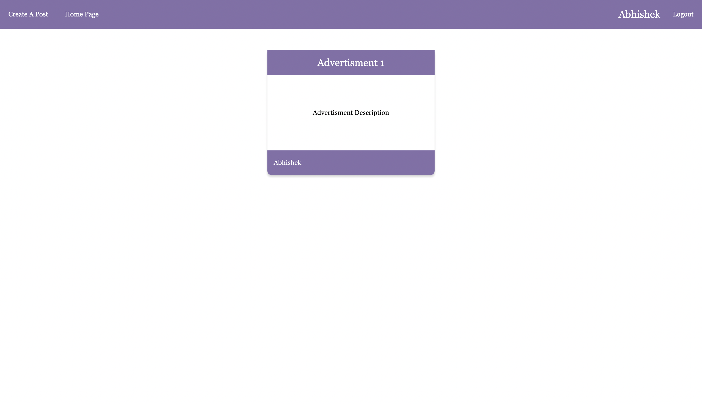
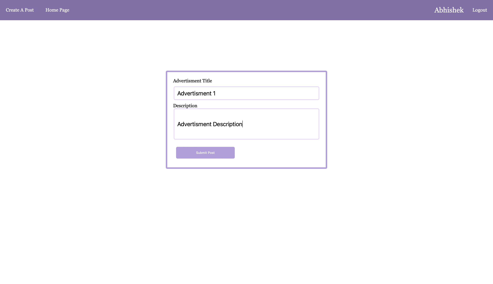
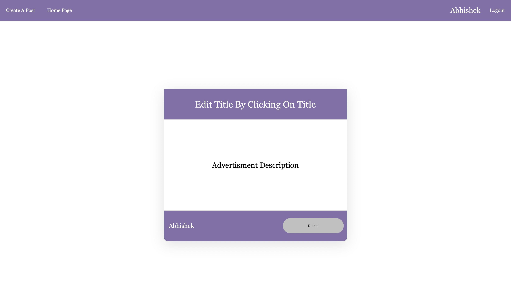
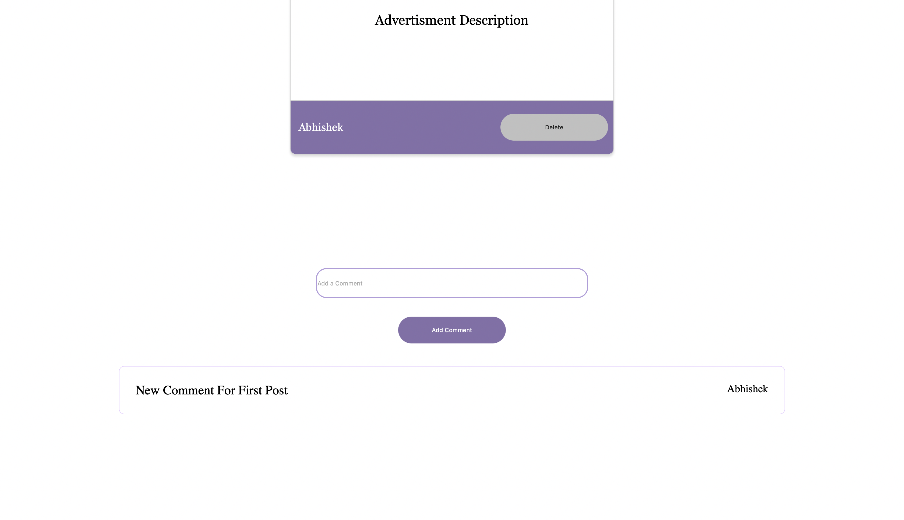
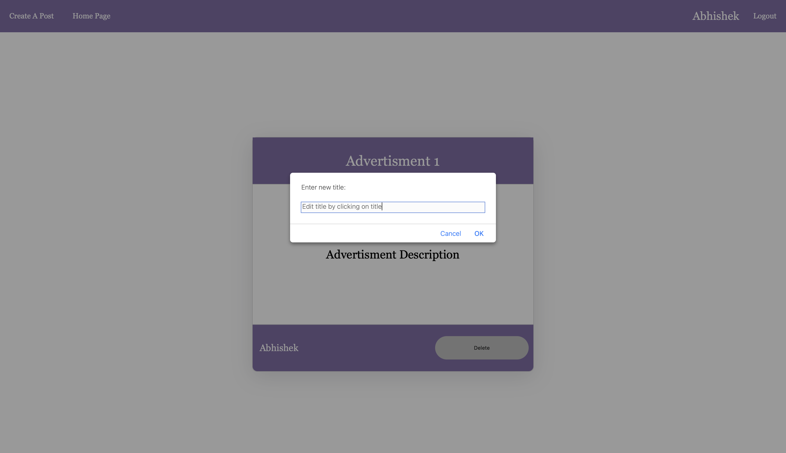

# Advertisment App

An Full-Stack App for posting advertisments. Login, Registration, Comments and Post data is stored in the backend using Node.js and Express.js and is stored in a SQL database  and front end is made in React.


## Tech Stack

**Client:** React

**Server:** Node, Express

**Database:** MySQL2, Sequelize

**Authentication/ Hashing:** JWT, bcryptjs


## Run Locally

Clone the project

```bash
  git clone https://github.com/av1choudharyy/Advertisment-Web-App
```

Go to the client directory

```bash
  cd client
```

Install dependencies

```bash
  npm install
```

Run the project

```bash
  npm start
```
In a new terminal window, go to the server directory

```bash
  cd server
```

Install dependencies

```bash
  npm install
```

Start the server

```bash
  npm start
```


## Color Reference

| Color             | Hex                                                                |
| ----------------- | ------------------------------------------------------------------ |
| Primary Color |  #b39ddb |
| Dark Color |  #836fa9 |
| Light Color |  ##e6ceff |


## Screenshots











## Deployment

The web app server is deployed on Heroku and the client is deployed on Netlify.
Also the web app is live on my own website **temporarily**.

[Website](https://www.choudhary.codes)&emsp;[Netlify](https://tender-swanson-38be36.netlify.app)


